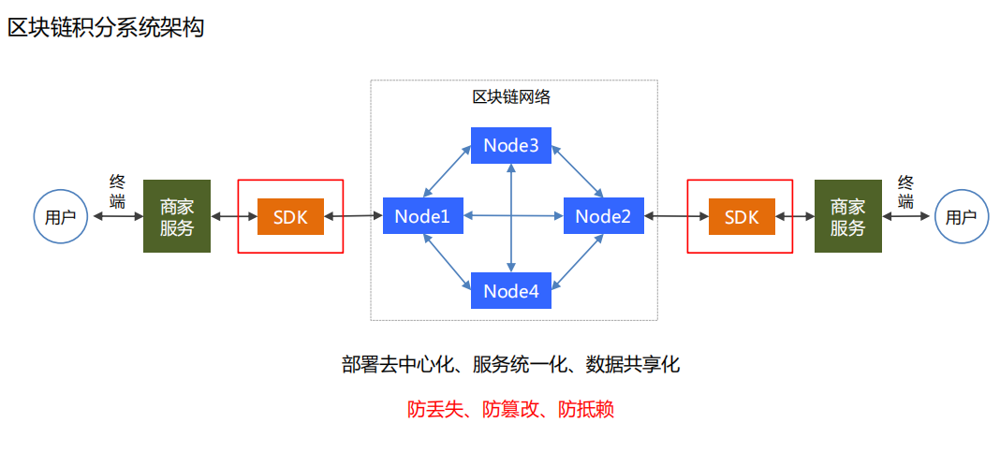
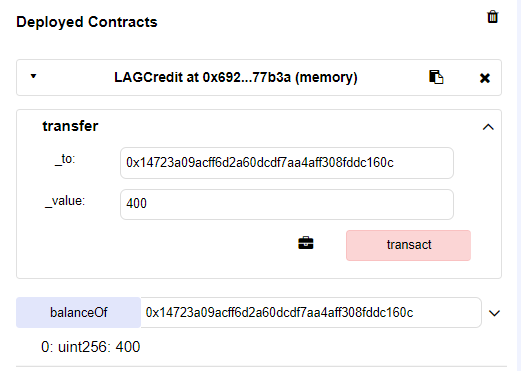

# day2——第一次周报

## 本周工作

### 积分系统的介绍
- 通过区块链发放一定额度的积分
- 通过首次消费获取一定量的积分
- 每次按消费金额也可以获得相应的积分
- 积分可在消费时抵扣金额
- 积分可以相互转换

### 区块链积分系统结构


### LAG合约的编写
```
pragma solidity >=0.4.22 <0.6.0;
contract LAGCredit {
    string name = "LAGC";
    string symbol = "LAG";
    uint256 totalSupply;
    
    // 地址对应余额
    mapping (address => uint256) private balances;
    
    // 用来通知客户端积分交易发生
    event transferEvent(address from, address to, uint256 value);

    //构造函数，由积分创建者执行:书店
    constructor(uint256 initialSupply, string creditName, string creditSymbol) public {
        totalSupply = initialSupply;
        balances[msg.sender] = totalSupply;
        name = creditName;
        symbol = creditSymbol;
    }
    //查询积分发放总额
    function gettotalsupply() constant returns (uint256){
        return totalSupply;
    }
    
    //积分的发送函数，内部函数
    function _transfer(address _from, address _to, uint256 _value) internal {
        require(_to != 0x0);
        require(balances[_from] >= _value);
        require(balances[_to]+ _value > balances[_to]); //value不能为负值
        uint previousBalances = balances[_from]+ balances[_to];
        balances[_from]-=_value;
        balances[_to] +=_value;
        transferEvent(_from, _to, _value); //记录转账并通知客户端发生积分交易
        assert(balances[_from] + balances[_to] == previousBalances);
    }
    
    //客户端调用的积分发送函数
    function transfer(address _to, uint256 _value) public {
        _transfer(msg.sender, _to, _value);
    }
    
    // 查询账户余额
    function balanceOf(address _owner) constant returns (uint256) {
        return balances[_owner];
    }

}
```

### LAG合约在控制台的部署和调用
1. 创建第一个用户


2. 使用第一个用户的私钥登录控制台


3. 部署合约，并创建500个scut积分。


4. 获取总积分数


5. 转积分到另一个用户中，并查看该用户余额。

